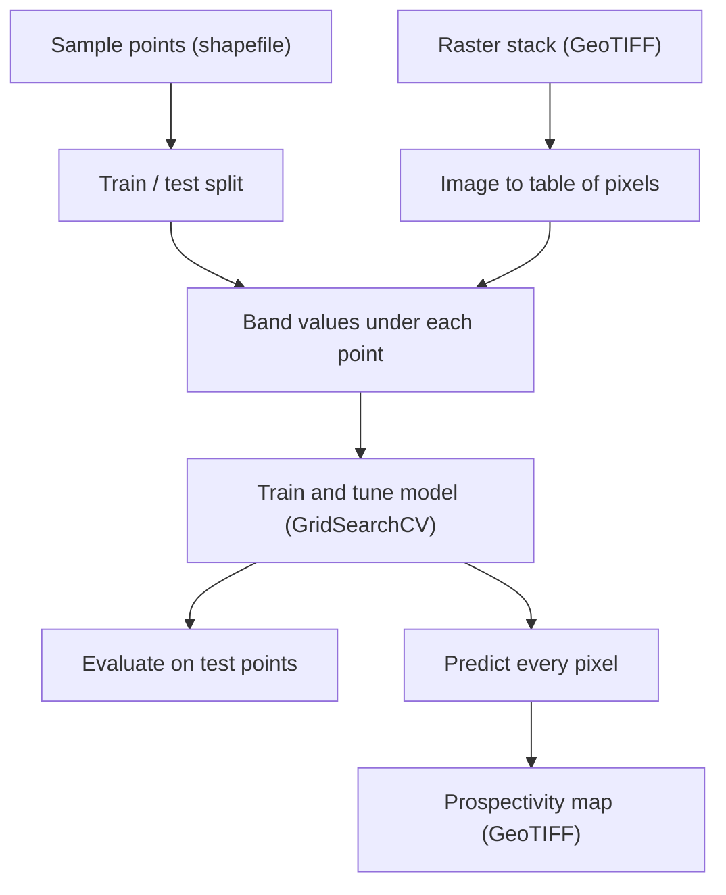

# Project Context

## Goal

Build a **mineral prospectivity map**: a map that ranks every part of an area by how likely it is to host a mineral deposit. The existing code did this for gold in Sudan's Hamassana area. The aim now is to adapt it to Malawi.

## What the existing code does

The code takes two inputs:

- **A raster stack**: satellite images and derived geology layers stacked into one GeoTIFF. Each layer is a *band*.
- **Sample points**: known locations labelled 1 (deposit present) or 0 (absent).

Four models (Random Forest, SVM, ANN and 1D CNN) learn what the deposit points look like across the bands. They then score every pixel, and the scores are saved as a GeoTIFF map.

### Files

| File | Role |
|---|---|
| `Data_preprocessing.py` | Shared helpers. Reads rasters and shapefiles, extracts training data, and writes output maps. |
| `RF.py` | Random forest model |
| `SVM.py` | Support vector machine model |
| `ANN.py` | Neural network model |
| `CNN.py` | 1D convolutional network model |
| `codeTesting.py` | Quick test of the preprocessing functions |

### Key terms

- **Features (`x`)**: the band values at one pixel.
- **Label (`y`)**: 1 for a deposit, 0 for no deposit.
- **Train / test split**: models learn from one set of points and are graded on points they haven't seen.
- **Cross-validation**: training is repeated on different subsets of the data for a fairer score.
- **Regressor output**: every model outputs a continuous score, not a yes/no. That score is the prospectivity value on the map.
- **AUC, confusion matrix, kappa**: measures of how well the scores separate deposit from non-deposit points.

## Adapting to Malawi

### Why the method needs adjusting

The Sudan area is desert with exposed rock, so satellite images show mineral alteration directly. Much of Malawi is covered by vegetation and weathered soil. That means:

- Airborne geophysics (magnetics, radiometrics) and geological maps carry more weight than satellite images.
- Satellite imagery should come from the late dry season, when vegetation is lowest.
- ASTER shortwave-infrared bands are usable only from scenes taken before 2008, when that sensor failed.

### Target

Models are built for one deposit type at a time. The working choice is **gold in a single pilot area**, because the existing workflow already targets gold. The pilot area will be chosen once we know where reliable occurrence data exists.

### Data to gather

- Geological maps and mineral occurrence records
- Airborne magnetic and radiometric data
- Sentinel-2 and Landsat imagery
- A 30 m elevation model

### Evidence layers

The map layers are designed around how gold deposits form:

- **Source**: rock types that could supply gold-bearing fluids.
- **Pathway**: faults and shear zones the fluids travelled along.
- **Trap**: contacts, fault intersections and alteration where the gold was deposited.

All layers share one grid in **WGS 84 / UTM zone 36S (EPSG:32736)**.

### Training points

- **Positives**: verified occurrences, with the source of each point recorded.
- **Negatives**: points chosen conservatively, away from known occurrences.
- **Balance**: similar numbers of positives and negatives.
- **Testing**: by geographic area instead of at random, because neighbouring points look alike.

## Roadmap

1. **Learn and prepare**: understand the codebase and get it running.
2. **Pilot area**: confirm the target and choose the pilot area based on the data available.
3. **Evidence stack**: collect and align the layers, and build the training points.
4. **Train and compare**: run all four models and compare their results.
5. **Validate**: review the maps against known geology and plan field checks.
